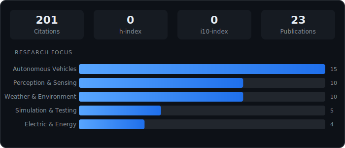

<!-- Typing Animation Header -->

_Specializing in real-time edge AI and agentic workflows for autonomous systems_

---

### About Me

Researcher and software engineer at **Argonne National Laboratory** specializing in automated vehicle research. My work spans edge-deployed AI systems, robust control systems for autonomous vehicles, and agentic AI workflows for real-time robotics applications.

---

### Tech Stack

---

### Research Impact

---

### 🐍 Contributions

<picture>
  <source media="(prefers-color-scheme: dark)" srcset="https://raw.githubusercontent.com/nickgoberville/nickgoberville/output/github-contribution-grid-snake-dark.svg" />
  <source media="(prefers-color-scheme: light)" srcset="https://raw.githubusercontent.com/nickgoberville/nickgoberville/output/github-contribution-grid-snake.svg" />
  
</picture>

---

